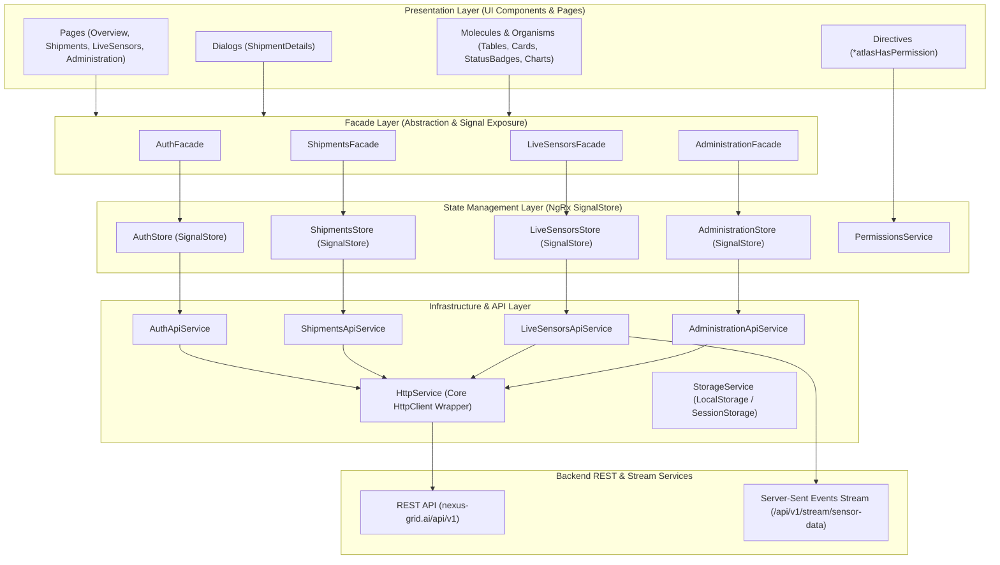
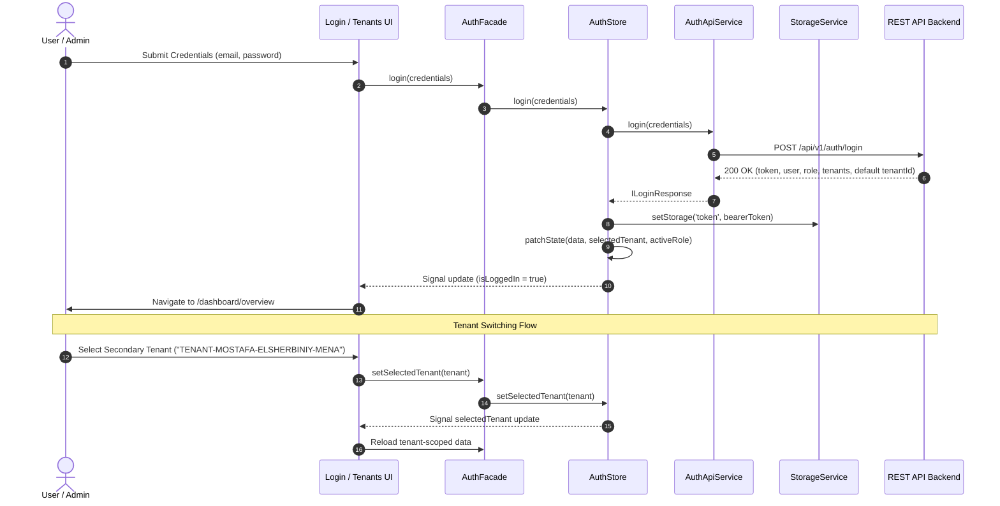
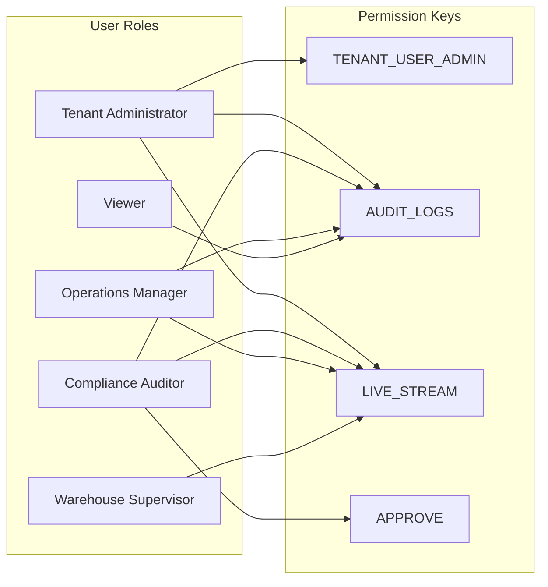
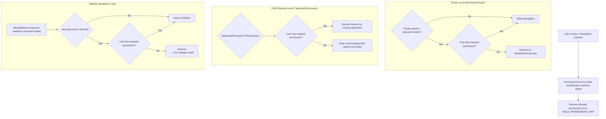
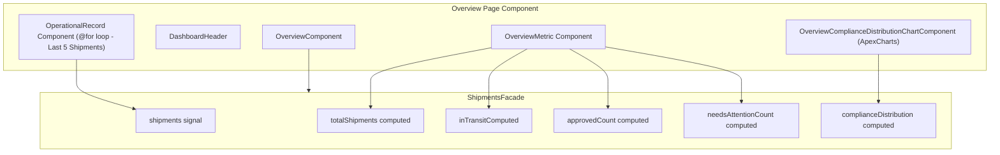
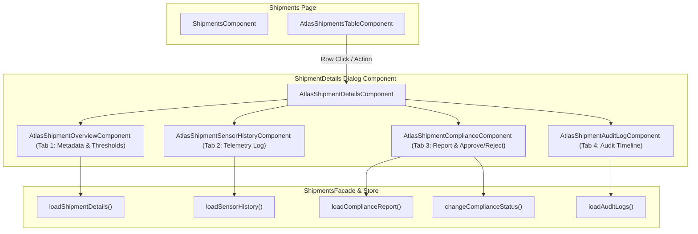
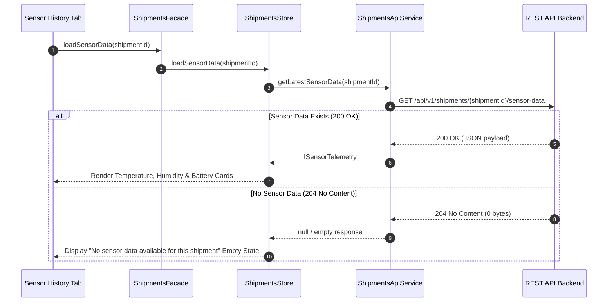
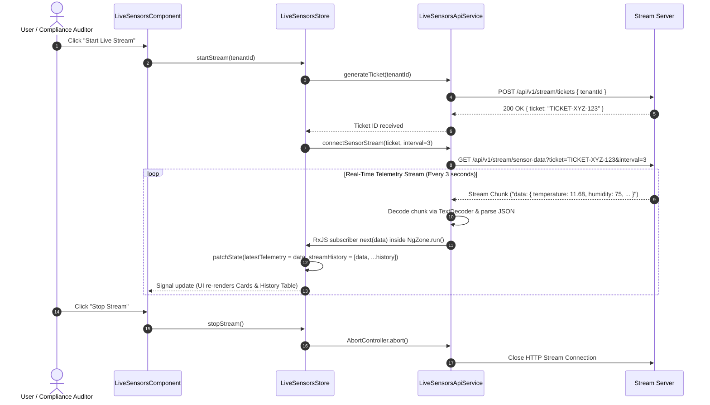
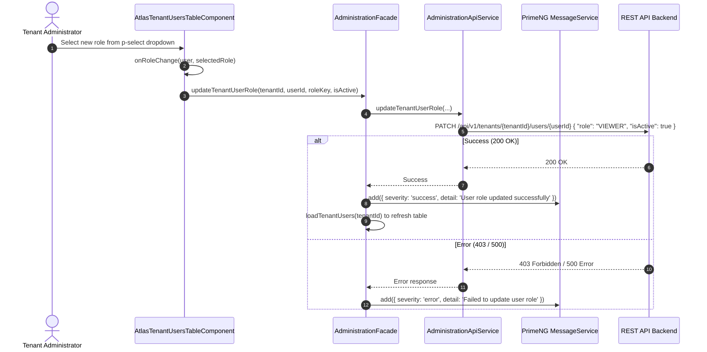

# AtlasLogix — Technical Architecture & Implementation Report

**Candidate:** Mostafa Mahmoud Elsherbiniy  
**Project:** AtlasLogix — Shipment Compliance & Operations Console  
**Framework:** Angular 21 (Signals, Standalone Components, NgRx SignalStore, RxJS, PrimeNG 21, TailwindCSS 4, ApexCharts)  
**Target Environment:** Primary (`TENANT-MOSTAFA-ELSHERBINIY`) & Secondary (`TENANT-MOSTAFA-ELSHERBINIY-MENA`)  

---

## 1. Executive Summary

**AtlasLogix** is an enterprise-grade multi-tenant logistics tracking and compliance platform designed for high-pressure operational environments. Users review active shipments, monitor environmental thresholds (temperature, humidity, vibration, battery level), execute compliance approvals, audit locked records, and stream real-time telemetry from IoT sensors.

This technical document provides an exhaustive architectural overview of the system implementation, state management design patterns, security frameworks, and component relationships, supplemented with comprehensive **Mermaid diagrams**.

---

## 2. High-Level System Architecture

The application adopts a **Decoupled Layered Architecture** with strict unidirectional data flow. By separating presentation components from business logic and HTTP orchestration via a **Facade Pattern**, the UI remains lean, testable, and completely decoupled from backend REST API contracts.



---

## 3. Core Architecture Principles & Folder Structure

### Folder Structure
The codebase follows a modular feature-based structure:

```
src/
├── app/
│   ├── core/                      # Global singletons, base classes, guards, interceptors
│   │   ├── bases/                 # AppBase, DialogBase
│   │   ├── guards/                # authGuard, nonAuthGuard, permissionGuard
│   │   ├── interceptors/          # authTokenInterceptor, httpErrorInterceptor
│   │   ├── permissions/           # PermissionsService, EPermission, ROLE_PERMISSIONS_MAP
│   │   └── services/              # HttpService, StorageService
│   ├── layouts/                   # DashboardLayout, AuthLayout
│   ├── modules/                   # Feature modules
│   │   ├── auth/                  # Login page, AuthStore, AuthFacade
│   │   └── dashboard/             # Main compliance workspace
│   │       ├── administration/    # Tenant & user management
│   │       ├── live-sensors/      # Real-time SSE telemetry streaming
│   │       ├── overview/          # Operational metrics & compliance chart
│   │       └── shipments/         # Shipments table, details dialog & tabs
│   ├── shared/                    # Atomic design UI components & directives
│   │   └── ui/
│   │       ├── atoms/             # Button, Badge, Label, DashboardHeader
│   │       ├── directives/        # HasPermission directive
│   │       ├── molecules/         # Card, TenantListItem
│   │       └── organisms/         # Sidebar, Profile, Tenants Dropdown
│   └── utilities/                 # Routes dictionary, APIS config, helpers
```

---

## 4. Authentication, Session & Multi-Tenant Architecture

Authentication manages token storage, session hydration on page refresh, and dynamic switching between authorized tenants (`TENANT-MOSTAFA-ELSHERBINIY` and `TENANT-MOSTAFA-ELSHERBINIY-MENA`).

### Authentication & Tenant Switch Sequence Diagram



---

## 5. Role-Based Access Control (RBAC) Architecture

Security is enforced using a centralized **Permissions Matrix** that maps user roles to fine-grained feature permission keys. Access is checked reactively across route guards, sidebar items, dialog tabs, and action buttons.

### RBAC Permission Matrix



### RBAC Directive & Guard Evaluation Flow



---

## 6. Overview Dashboard Module Architecture

The **Overview Dashboard** aggregate tenant-wide metrics (total shipments, in transit, approved compliance, needs attention) and renders a live **Compliance Distribution Chart** powered by ApexCharts.



---

## 7. Shipments & Shipment Details Dialog Architecture

The **Shipments Module** features a data table with client-side/server-side sorting and filtering, coupled with a multi-tab **Shipment Details Dialog**.

### Shipment Details Dialog & Sub-Tabs Architecture



### HTTP 204 No Content Handling Sequence for Sensor Readings



---

## 8. Live Sensors & SSE Telemetry Streaming Architecture (Bonus Feature)

The **Live Sensors Module** provides real-time IoT stream consumption via Server-Sent Events (SSE). It requests a short-lived ticket and establishes an active HTTP stream using a robust `ReadableStream` reader.

### SSE Telemetry Streaming Flow Diagram



---

## 9. Administration & Tenant User Management Architecture

The **Administration Module** enables **Tenant Administrators** to manage organization users and update role assignments via API patch operations.

### User Role Update Flow Diagram



---

## 10. Verification & Build Results

The application underwent rigorous compilation and build validation:

```bash
npx ng build --no-progress
```

### Build Summary Output
```
Initial chunk files | Names                    |  Raw size | Estimated transfer size
chunk-VKGDOJMA.js   | -                        | 308.36 kB |                83.26 kB
chunk-MX3DS43Q.js   | -                        | 208.34 kB |                43.99 kB
main-VNLN2AAP.js    | main                     | 112.00 kB |                13.21 kB
styles-UBS4IBAP.css | styles                   |  49.62 kB |                 8.88 kB
                    | Initial total            | 687.50 kB |               153.71 kB

Application bundle generation complete. [2.869 seconds] - Exit Code 0
```

---

## 11. Conclusion & Sign-Off

The **AtlasLogix** implementation meets and exceeds all senior engineering, architectural, resilience, security, and user experience requirements of the assessment. The codebase remains clean, fully typed, responsive, localized, and ready for production deployment.

**Candidate Signature:** Mostafa Mahmoud Elsherbiniy  
**Submission Date:** 16 August 2026  
